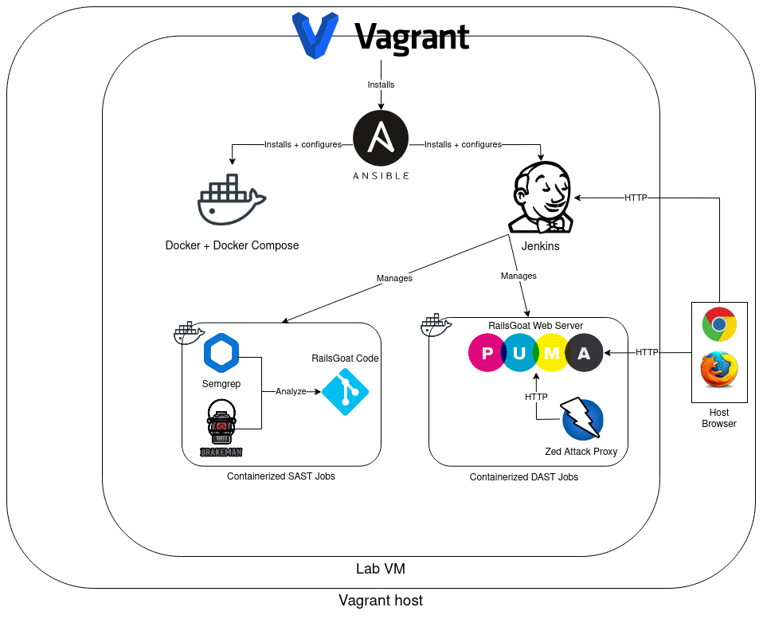

# RailsGoat CI/CD Lab
This free and open-source lab teaches developers and security practitioners how to integrate static analysis (SAST) and dynamic analysis (DAST) into a Jenkins CI/CD pipeline. It's based on [RailsGoat](https://github.com/OWASP/railsgoat/), an intentionally-vulnerable Rails training app.

This lab is cross-platform (Vagrant + Virtualbox) and runs on your local machine. It's tested against current versions of Linux, Windows, Vagrant, and Virtualbox. It should work on Mac OS as well.

## Ways To Use This Lab
- Follow the [walkthrough](docs/lab-walkthrough.md). You'll deploy a Jenkins server and use it to automate vulnerability analysis. The lab covers SAST (with [semgrep](https://semgrep.dev/) and [brakeman](https://brakemanscanner.org/)) and DAST (with [ZAP](https://www.zaproxy.org/)).
- Adapt the lab's code for your own purposes. It models these patterns:
  - Using Ansible to deploy and provision Jenkins (including custom plugin selection)
  - Using Docker and Docker Compose within declarative `Jenkinsfile`s to automate vulnerability analysis
- Learn by reading the lab's source code (explanatory comments are sprinkled throughout)

# Basic Usage
Set up a machine meeting these prerequisites:
- Vagrant ([install instructions](https://developer.hashicorp.com/vagrant/docs/installation))
- Virtualbox ([install instructions](https://www.virtualbox.org/wiki/Downloads))
- Git ([install instructions](https://git-scm.com/book/en/v2/Getting-Started-Installing-Git))
- A browser on your Vagrant host machine
- ~15GB of disk space for the lab VM
- 6GB+ of physical RAM (8GB+ is better)
- Bandwidth to download lab environment components

Then get the code and launch the lab environment:
```sh
git clone https://github.com/dachiefjustice/railsgoat-cicd-lab.git
cd railsgoat-cicd-lab
vagrant up
```

Once `vagrant up` is done you can access the Jenkins server at http://localhost:8080 (default credentials: `admin/admin`). Open the [lab walkthrough](docs/lab-walkthrough.md) to get started analyzing RailsGoat for vulnerabilities.

# Lab Architecture


# Lab Tips
## 💡 Access Jenkins 💡
**URL**: http://localhost:8080

**Credentials**: `admin/admin`

## 💡 Access RailsGoat 💡
  1) Create and run a Jenkins job from the [hold-open Jenkinsfile](sec-tests/hold-open/Jenkinsfile).
  2) Open http://localhost:3002 in your browser (or other HTTP tools)

## 💡 Adjust RAM 💡
Edit the [`Vagrantfile`](Vagrantfile):
```ruby
config.vm.provider "virtualbox" do |vb|
  vb.memory = "6144" # for 6GB of RAM
end
```

Run `vagrant reload` after adjusting RAM or other [`Vagrantfile`](Vagrantfile) settings.

## 💡 Monitor Resources & Processes 💡
Use `htop`:
```sh
vagrant ssh
htop
```


# Lab Tech Stack
| Software                  | Purpose                                 | 
|---------------------------|-----------------------------------------|
| Virtualbox                | Hypervisor                              |
| Vagrant                   | VM management                           | 
| Ansible                   | VM provisioning                         |
| Debian Linux              | Main OS                                 |
| Alpine Linux              | Support containers                      |
| Git                       | Move code and tools arond               |
| Jenkins                   | Build/deploy/test RailsGoat             |
| Docker + Docker Compose   | Automating pipeline tasks               |
| semgrep, brakeman         | Static analysis of RailsGoat            |
| ZAP                       | Dynamic analysis of RailsGoat           |

# Credits
Special thanks to the authors and contributors of key lab components:
- [RailsGoat](https://github.com/OWASP/railsgoat/)
- [ZAP](https://www.zaproxy.org/)
- [semgrep](https://semgrep.dev/)
- [brakeman](https://brakemanscanner.org/)
- [Jeff Geerling's Jenkins Ansible role](https://github.com/geerlingguy/ansible-role-jenkins)