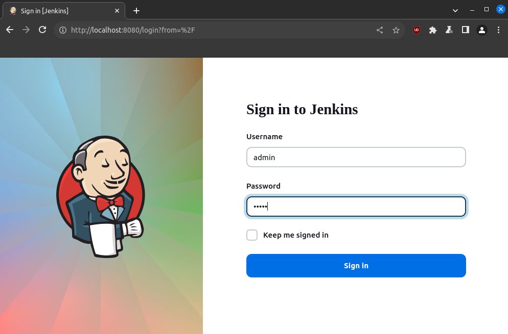

# Lab Walkthrough: Automating DAST
In this section you'll automate two scans using Zed Attack Proxy (ZAP):
- Baseline scan
- Authenticated scan

## ZAP Baseline Scan
In the [lab exploration](lab-walkthrough-exploration.md) section you used ZAP to run a baseline scan against RailsGoat. Now it's time to automate that scan.

Make sure the VM is up: `vagrant up`

Log into Jenkins at http://localhost:8080 from a browser on your Vagrant host (default credentials are `admin/admin`):

## ZAP Authenticated Scan
