# Lab Walkthrough
## Initial Setup
Follow the [README](../README.md)'s basic usage instructions to get started:

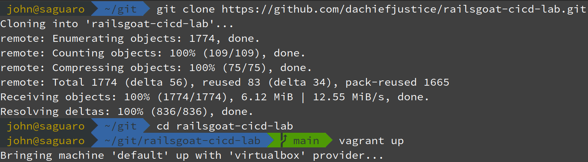

After running `vagrant up` you'll see a lot of output as Vagrant provisions the VM:
1) Vagrant installs Ansible (using the [`ansible_local` provisioner's automatic installation](https://developer.hashicorp.com/vagrant/docs/provisioning/ansible_local#install))
2) Ansible installs and configure Jenkins + Jenkins plugins, Docker, and Docker Compose.

The VM is ready once you return to a shell prompt preceded by a welcome message:
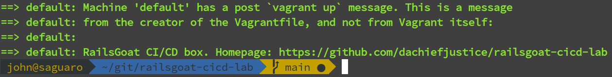

## Explore The Lab Environment
### Explore The CLI
Get a shell in the lab machine, and check that you can access the lab's code via `/vagrant` (Vagrant maps this automatically during `vagrant up`). This lab's Jenkins pipelines use the `/vagrant` mapping.

```sh
vagrant ssh
ls -la /vagrant # show the lab's root directory contents
```
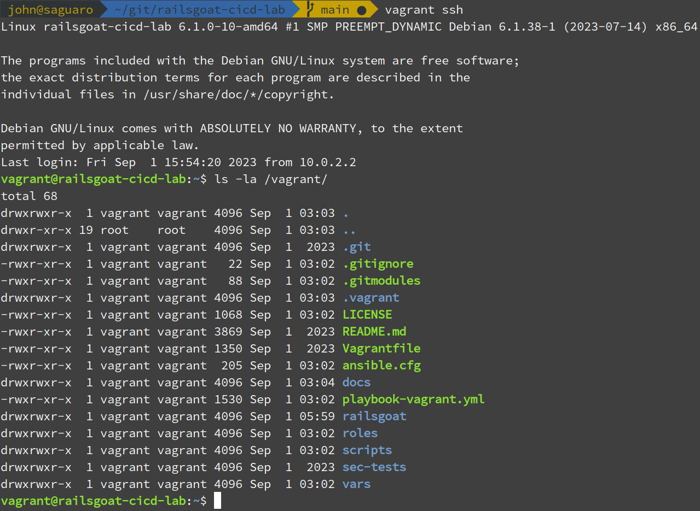

Check that Jenkins is running with `systemctl status jenkins.service` (press `q` to exit after confirming that Jenkins is loaded):
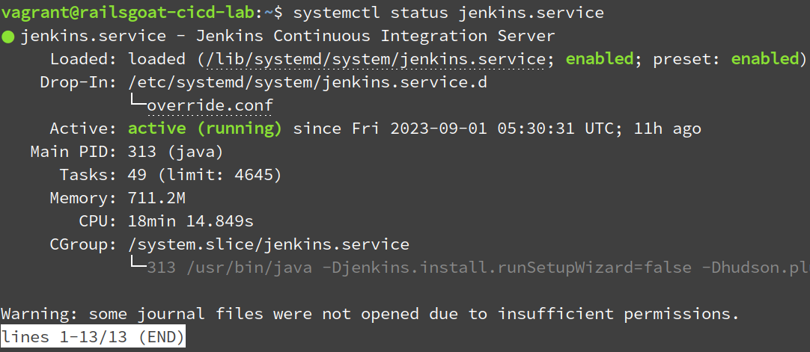

Use `htop` to explore system resources and processes (press `q` to exit afterwards):
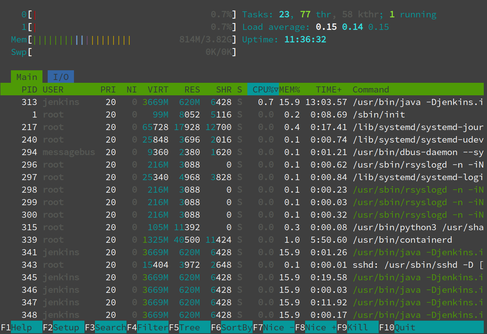

### Explore The Jenkins Web Interface
#### Initial Login
Log into the Jenkins web interface at http://localhost:8080 with the default credentials (`admin/admin`):
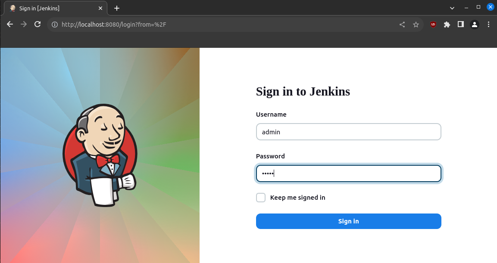

### RailsGoat
#### Launch RailsGoat via Jenkins
It's time set up the first Jenkins pipeline! Pipelines are sometimes called jobs -- you'll see these terms used interchangeably. A pipeline is typically defined in a `Jenkinsfile`. This lab uses Jenkins pipelines for security analysis. 

Start by making a job that runs RailsGoat and ZAP in containers, holding them open together so you can explore RailsGoat. Click `Create a job`:
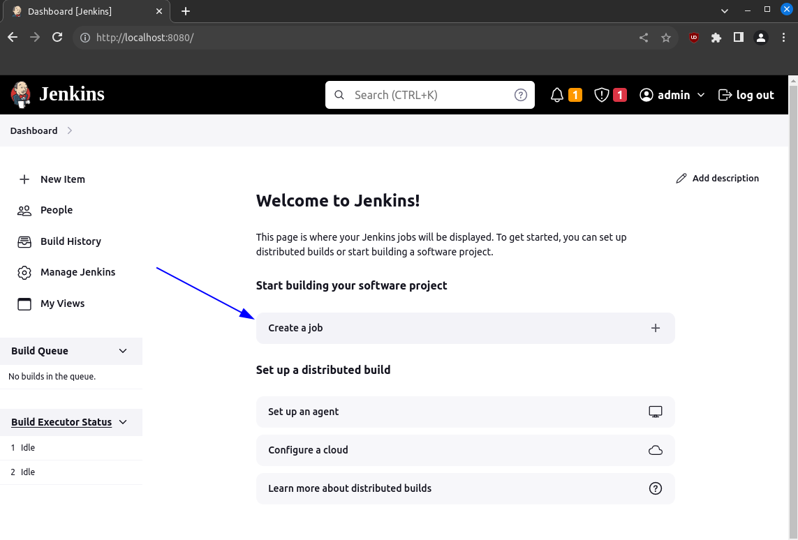

Name the job `hold-RailsGoat-open` (or whatever you like). Select "Multibranch Pipeline" as the job type, and press OK:
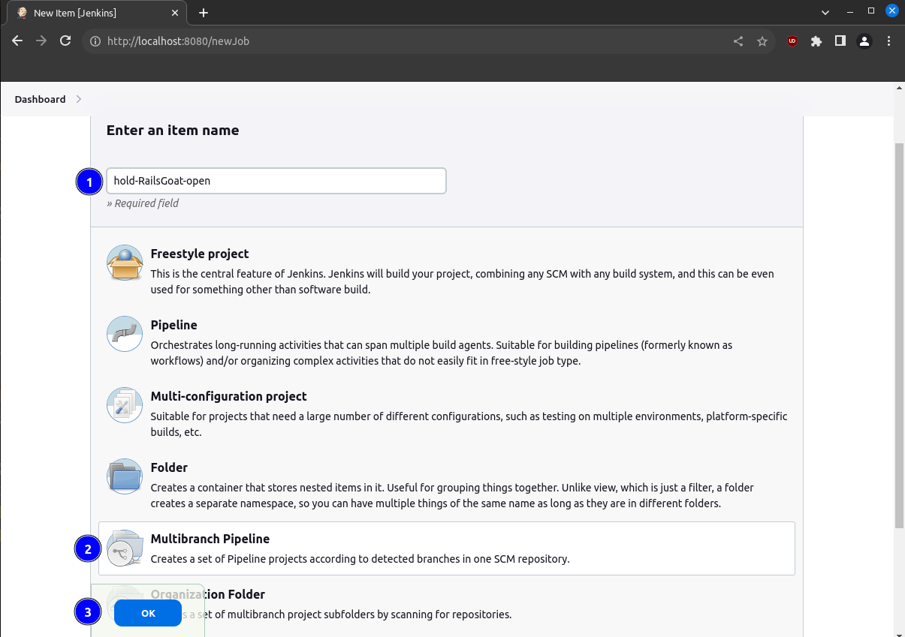

On the next screen give the job a display name (whatever you like, `hold-RailsGoat-open` in the screenshot). Add a branch source specifying `file:///vagrant` as the `Project Repository`:
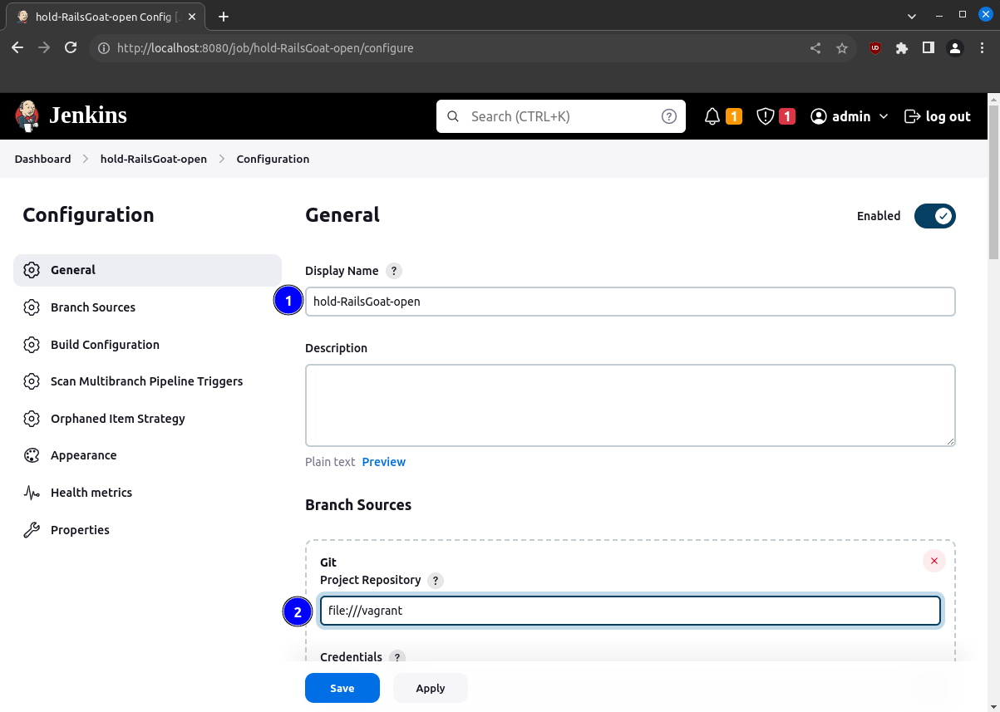

Scroll down to the `Build Configuration` section and specify `sec-tests/hold-open/Jenkinsfile` as the `Script Path`. Then press Save:
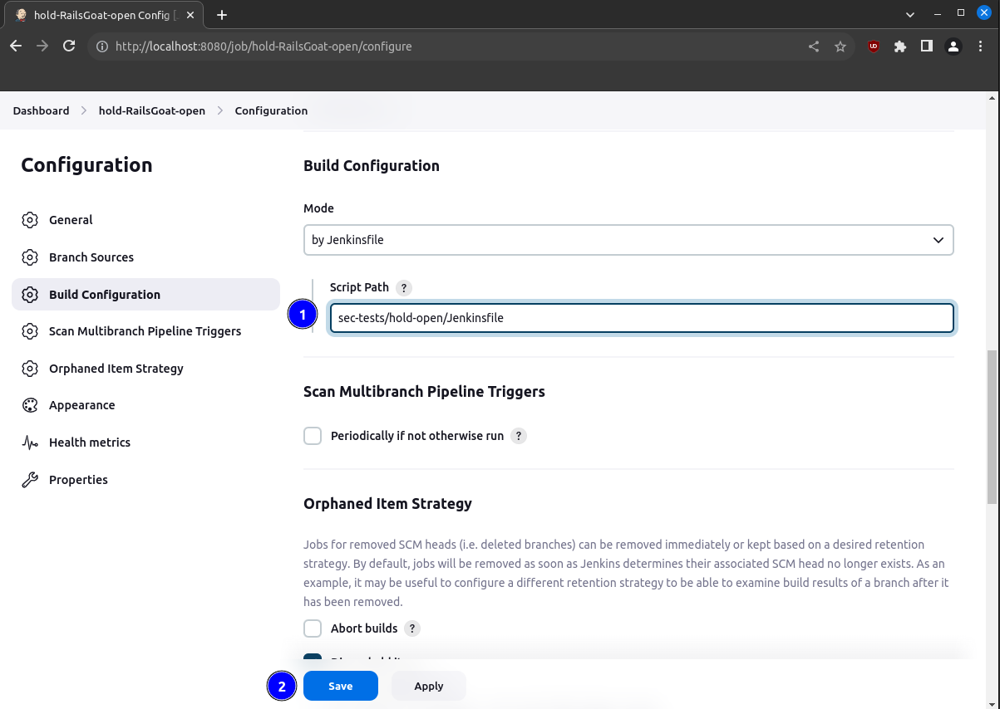

After pressing Save, Jenkins scans the repository and starts a build. Click the `#1 (hold-open)` link to open that build:
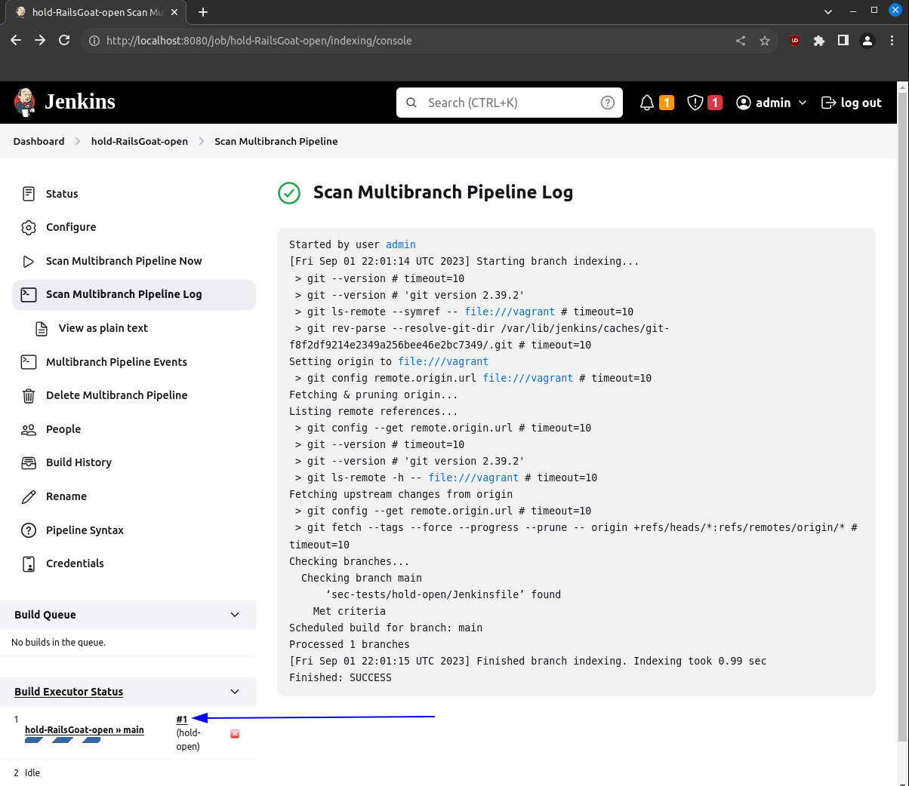

Then click the `Console Output` button:
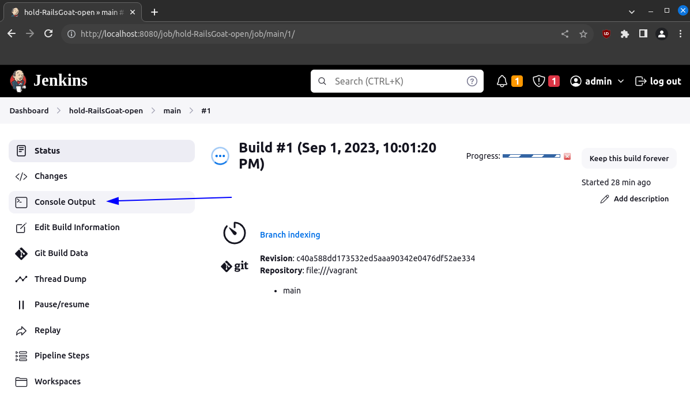

Scroll to the bottom. Notice that Jenkins is sitting on a line like `Attaching to hold-open-zap-holdopen-with-railsgoat-1`:
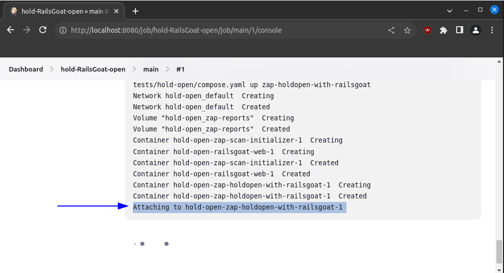

This means that Jenkins is running RailsGoat for you. Confirm this by opening a new tab and browsing to http://localhost:3002 and you should see the RailsGoat login page:
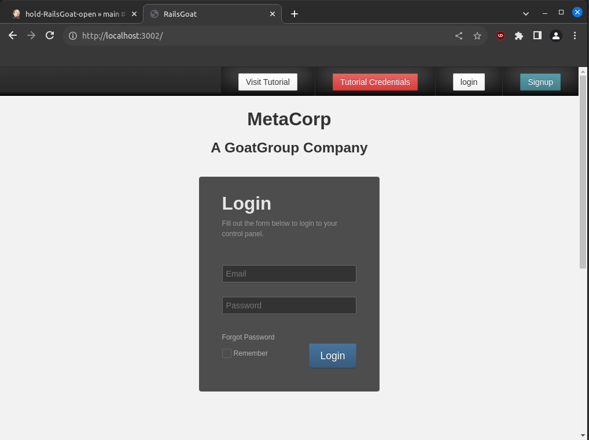

From here play around with RailsGoat -- create yourself a test account, log in, and poke around. You can also search for and exploit vulnerabilities manually.

This works because port 3002 is used in the [the job's `compose.yaml`](../sec-tests/hold-open/compose.yaml), and is forwarded in the [project's `Vagrantfile`](../Vagrantfile). This port-forward is restricted to `127.0.0.1` so other machines on your network can't exploit these vulnerabilities (without first compromising your Vagrant host, at least).

#### Hold-Open Job Explainer
Let's walk through this job in detail.

First, the job's purpose: run RailsGoat and ZAP containers together until you stop them by cancelling the job. This lets you browse RailsGoat and manually scan it from ZAP.

Next, the job's pipeline definition: [`sec-tests/hold-open/Jenkinsfile`](../sec-tests/hold-open/Jenkinsfile). The most important section of this `Jenkinsfile`:
```groovy
stage('hold-open') {
    steps {
        // Hold ZAP and RailsGoat open together
        sh 'docker-compose --file $WORKSPACE/sec-tests/hold-open/compose.yaml up zap-holdopen-with-railsgoat'
    }
}
```

Here's what each component of this section does:
- The `hold-open` stage is a descriptively-named [Jenkins stage](https://www.jenkins.io/doc/book/glossary/#stage). Stages group related pipeline steps together; common stage names include variations on `build`, `test`, and `deploy`. Naming stages descriptively is a good practice. Stage names show up in the Jenkins web interface:
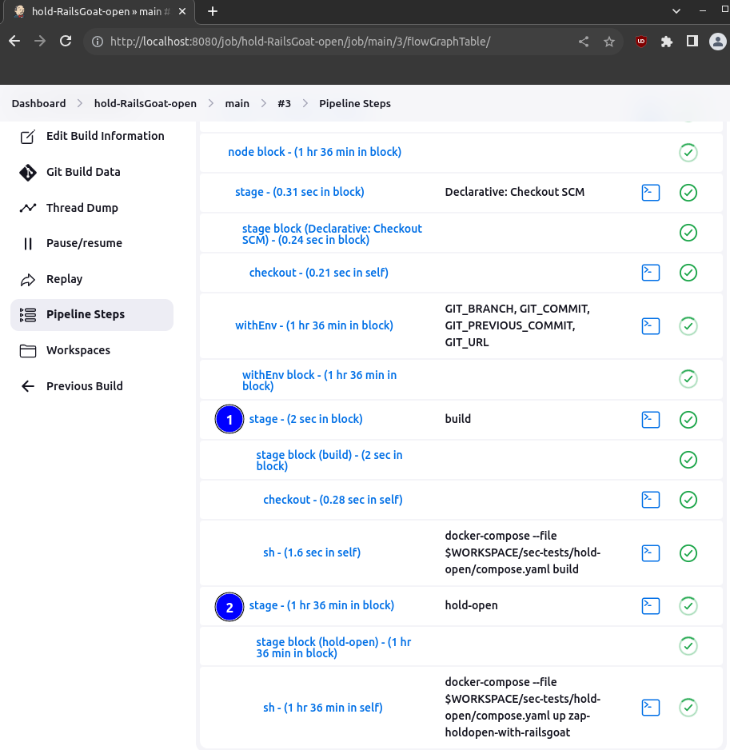
- The [Jenkins `sh` step](https://www.jenkins.io/doc/pipeline/steps/workflow-durable-task-step/#sh-shell-script) runs a shell script. In this case, it uses `docker-compose up` to run RailsGoat and ZAP containers as defined in [`sec-tests/hold-open/compose.yaml`](../sec-tests/hold-open/compose.yaml).
- [`sec-tests/hold-open/compose.yaml`](../sec-tests/hold-open/compose.yaml) is a [Docker Compose file](https://docs.docker.com/compose/compose-file/03-compose-file/) that defines the components and configuration for RailsGoat and ZAP containers. Docker's networking includes a DNS server that maps service names from the Compose file onto container IP addresses. This lets containers access each other's ports via a static hostname, rather than needing to know each other's dynamically assigned IP addresses.
- `$WORKSPACE` (part of the path to this job's `compose.yaml`) is a Jenkins-defined environment variable holding the absolute path to the "workspace" for this job. A Jenkins workspace contains the job's files and directories. In this case the workspace contains a copy of the lab's source code checked out from the `/vagrant` directory.

### ZAP Baseline Scan
So far we've used the hold-open job to access RailsGoat through a browser. This hold-open job includes a ZAP container which can analyze RailsGoat for vulnerabilities. Let's use this to scan RailsGoat manually.

Get a shell in the VM (`vagrant ssh`) and list the currently running containers (`docker ps`). You'll see two running containers -- one for ZAP, the other for RailsGoat.

You can find the ZAP container from the image name (it will contain `zaproxy`). Copy the ZAP container ID for use in the next command (`94572b01272a` in this example, yours will be different).

```sh
vagrant ssh
docker ps
```
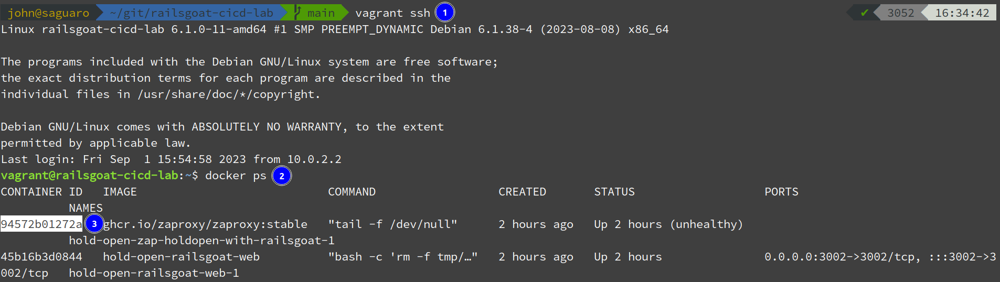


Now that you know the ZAP container ID, get a shell in the ZAP container and start a baseline scan:
```sh
docker exec -it your-ZAP-container-ID bash      # get a shell in the ZAP container
./zap-baseline.py -t http://railsgoat-web:3002  # start a baseline scan
```
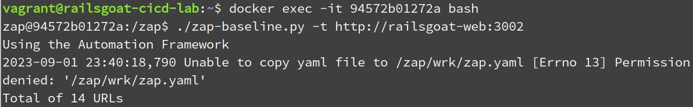

The scan will finish in a minute or two and find some basic security issues:
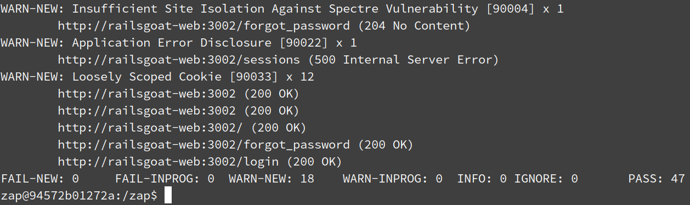

These issues are relatively uninteresting -- no SQL injection, cross-site scripting or other severe vulnerabilities. However, RailsGoat contains these vulnerabilities. Why didn't ZAP find them?

[ZAP's baseline scan](https://www.zaproxy.org/docs/docker/baseline-scan/) performs basic HTTP spidering and analyzes the results passively, rather than performing active or authenticated scanning. ZAP's baseline scan doesn't find many URLs (14 during my testing, which is a small subset of all RailsGoat URLs):
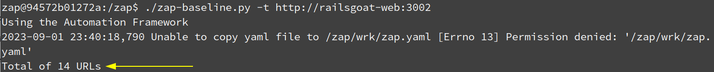

ZAP can discover application URLs using two spidering methods:
- The [traditional spider](https://www.zaproxy.org/docs/desktop/addons/automation-framework/job-spider/) makes HTTP requests and parses the resulting HTML for URLs.
- The [AJAX spider](https://www.zaproxy.org/docs/desktop/addons/ajax-spider/automation/) makes HTTP requests and analyzes the resulting HTML *and* JavaScript by "clicking" URLs inside a ZAP-managed web browser. Compared with the traditional spider this does a better job discovering URLs in JavaScript-heavy web applications, and is slower and more resource-intensive.

RailsGoat uses a mix of HTML and JavaScript URLs. Most RailsGoat URLs are gated behind authentication. Since ZAP's baseline scan uses the traditional spider without authentication or active scanning, the scan finishes quickly but doesn't find severe or harder-to-discover issues. Later in the lab you will configure ZAP to perform a more comprehensive, authenticated, slower scan.

Back in the browser, cancel the `hold-RailsGoat-open` job:
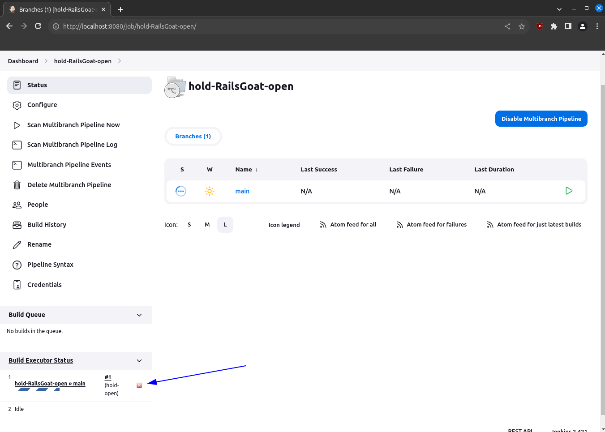

Now you've explored the lab environment a bit, and learned:
- How to create a Jenkins job from a `Jenkinsfile` pipeline definition
- The basic structure of a Jenkins pipeline/job
- How `docker-compose` networking allows containers to access each other via hostnames
- How to identify which containers a job uses, and manually execute commands in those containers
- How to manually run a ZAP baseline scan

