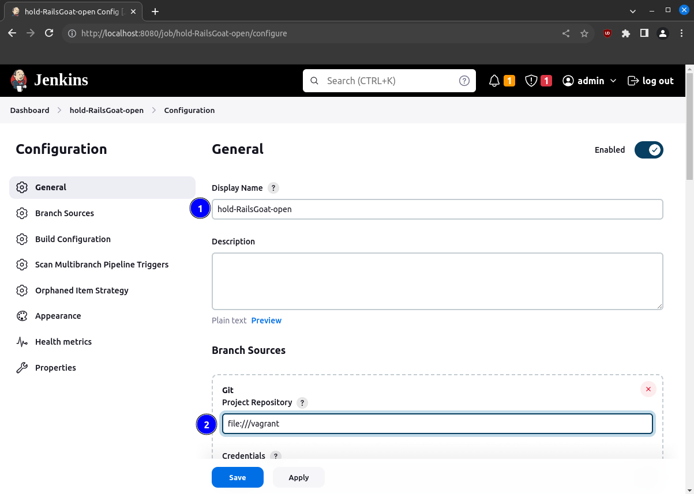

# Lab Walkthrough
## Initial Setup
Open the [README](../README.md) and follow the basic usage instructions to get started:


After running `vagrant up,` you'll see a lot of output as Vagrant provisions the VM:
1) Vagrant installs Ansible (with the `ansible_local` provisioner's automatic installation)
2) Ansible installs and configure Jenkins + Jenkins plugins, Docker, and Docker Compose.

The VM is set up once you return to a shell prompt preceded by a welcome message:


## Explore The Lab Environment
### Command Line
Get a shell in the lab machine, and notice that you can access the lab's code via `/vagrant` (Vagrant does this automatically as part of `vagrant up`). The Jenkins jobs you'll create to find security issues uses this.

```sh
vagrant ssh
ls -la /vagrant
```


Check that Jenkins is running with `systemctl status jenkins.service` (press `q` to exit the Jenkins status info after confirming that Jenkins is loaded):


Use `htop` to explore system resources and processes (press `q` to exit afterwards):


### Jenkins
#### Initial Login
Log into the Jenkins web interface at http://localhost:8080 with the default credentials (`admin/admin`):


### RailsGoat
#### Launch RailsGoat via Jenkins
It's time set up the lab's first Jenkins job. This lab uses a bunch of pre-made Jenkins jobs for security analysis.

Start by making a job that runs RailsGoat in a container. Click `Create a job`:


Name the job `hold-RailsGoat-open` (or whatever you like). Select "Multibranch Pipeline" as the job type, and press OK:


On the next screen name the job (whatever you like, `hold-RailsGoat-open` in the screenshot). Add a branch source specifying `file:///vagrant` as the `Project Repository`:


Scroll down to the `Build Configuration` section and specify [`sec-tests/hold-open/Jenkinsfile`](../sec-tests/semgrep/Jenkinsfile) as the `Script Path`. Then press Save:


After pressing Save, Jenkins scans the repository and starts a build. Click the `#1 (hold-open)` to open that build:


Then click the `Console Output` button:


Scroll to the bottom. Notice that Jenkins is sitting on a line like `hold-open-zap-holdopen-with-railsgoat-1`:


This means that Jenkins is running RailsGoat for you. Confirm this by opening a new tab and browsing to http://localhost:3002, and you should see the RailsGoat login page:


#### Hold-Open Job Explainer
A few things worth pointing out about this Jenkins job:
- This job's `Jenkinsfile` uses `docker-compose` to launch RailsGoat:
```
steps {
  // Hold ZAP and RailsGoat open together
  sh 'docker-compose --file $WORKSPACE/sec-tests/hold-open/compose.yaml up zap-holdopen-with-railsgoat'
}
```

The `compose.yaml` file the job uses defines the components and configuration for a containerized RailsGoat (and ZAP).

This job will hold RailsGoat open so you can freely browse RailsGoat by visiting http://localhost:3002. From there you cancreate an account, search for vulnerabilities manually, and generally get used to it.

This hold-open job also includes ZAP container, which can analyze RailsGoat for vulnerabilities. You'll automate this later in the lab; for now, use ZAP to scan RailsGoat manually.

Get a shell in the VM, and use `docker ps` to find the running ZAP container:
```sh
vagrant ssh
docker ps
```

## Static Analysis
### Brakeman
Now that you've got Jenkins set up, time to analyze the RailsGoat codebase for security issues with Brakeman, a static analyzer that operates against Ruby-on-Rails source code.
1. If you're not logged into the Jenkins UI already, do so at http://localhost:8080 in a browser on the Vagrant host.
2. Create a new job/item in Jenkins. Call it `brakeman` (or something else if you prefer). Make the job a "Multibranch Pipeline" job.

3. In the job configuration screen, add a Git source repo. By default, Vagrant mounts the project directory (the cloned repo, in this case) from the host to the VM under `/vagrant`. Use that as the source repo for this job (`file:///vagrant`). The source repo contains a ready-made Jenkinsfile for scanning RailsGoat using Brakeman. Tell Jenkins about this by changing the `Build Configuration -> Script Path` field to `sec-tests/brakeman/Jenkinsfile`. 


4. When you hit the Save button, Jenkins should scan the repo, find the Jenkinsfile, build a container for Brakeman, and kick off the code scan.

5. If all goes well, you should be able to get the HTML report generated by Brakeman in the Jenkins job, from the master branch. If you called the job `brakeman` earlier, it should be under http://localhost:8080/job/brakeman/job/master/


### Semgrep

## Dynamic Analysis with Arachni
Now that you've got Jenkins set up, time to analyze the RailsGoat app for security issues with Arachni, a dynamic web application security scanner that operates over the network. The automation is a bit more in-depth than Brakeman, relying on two running containers (one for RailsGoat, one for Arachni) managed by Docker Compose. The process of setting up the job is similar to Brakeman; start there if you haven't done that yet, since the Brakeman job runs quickly.

1. If you're not logged into the Jenkins UI already, do so at http://localhost:8080 in a browser on the Vagrant host.
2. Create a new job/item in Jenkins. Call it `arachni` (or something else if you prefer). Make the job a "Multibranch Pipeline" job, like before with Brakeman.

3. In the job configuration screen, add a Git source repo. By default, Vagrant mounts the project directory (the cloned repo, in this case) from the host to the VM under `/vagrant`. Use that as the source repo for this job (`file:///vagrant`). The source repo contains a ready-made Jenkinsfile for scanning RailsGoat using Arachni. Tell Jenkins about this by changing the `Build Configuration -> Script Path` field to `sec-tests/arachni/Jenkinsfile`. 


4. When you hit the Save button, Jenkins should scan the repo, find the Jenkinsfile, build containers for RailsGoat, Arachni, and scan RailsGoat with Arachni. This will take a while (perhaps 30+ minutes), depending on your Internet speed, RAM allocated to your Vagrant VM, etc. Maybe some more coffee.

5. Check progress by clicking through the Jenkins UI and viewing the console output for the running build/job. If you called the job `arachni` earlier and this is the first time you're running the build, it should be available at http://localhost:8080/job/arachni/job/master/1/console

6. After the job finishes, you should be able to get a zipped HTML report generated by Arachni in the Jenkins job, from the master branch. If you called the job `arachni` earlier, it should be under http://localhost:8080/job/arachni/job/master/


The default scan for this lab uses a subset of Arachni's tests to keep scan times reasonable.

## Lab Exercise & Self-Directed Learning
If you're enjoying this lab, here's a exercise for you: [RailsGoat](https://github.com/OWASP/railsgoat/) contains a set of failing Capybara RSpecs. Try making a Jenkins job that will run these and capture the output in the Jenkins build. Change stuff, see what breaks, try and fix it.

You'll get the most out of this lab if you take time to read the `Jenkinsfile`s, `Dockerfile`s, and `docker-compose.yml` files. Figure out how stuff that's new to you works. The [Jenkins docs](https://jenkins.io/doc/), [Docker docs](https://docs.docker.com/), [Brakeman docs](https://brakemanscanner.org/docs/), and [Arachni wiki](https://github.com/Arachni/arachni/wiki) are excellent resources.

## Under the Hood with Brakeman
Some of the stuff going on under the hood with the Brakeman test:

- Why use Alpine Linux for the Brakeman container? It's lightweight, minimizes attack surface, and results in smaller, faster, and cleaner Docker containers than more full-featured Linux distributions.
- The `checkout scm` step in the `Jenkinsfile` copies the source repo configured in Jenkins jobs into the workspace (for later use by the Brakeman container).
- Jenkins sets [a bunch of environment variables](https://wiki.jenkins.io/display/JENKINS/Building+a+software+project) like `WORKSPACE` and `BUILD_TAG`. These are handy in `Jenkinsfile`s for automating stuff like tagging container images, bind-mounting Docker volumes to the Jenkins workspace, etc. 
- The RailsGoat project is a [submodule](https://git-scm.com/book/en/v2/Git-Tools-Submodules) of this repo, making it easy to pull upstream changes into the lab environment. In fact, the Brakeman Jenkinsfile does this as part of the build.
- Brakeman returns an exit status of 3 after successfully scanning the RailsGoat code. Jenkins assumes any non-zero exit code from a build step indicates a failed build, so there's extra logic to avoid this problem in the Brakeman Jenkinsfile.

## Under the Hood with Arachni
Some of the stuff going on under the hood with the Arachni scan:

- The scan profile (`arachni-railsgoat-quickscan.afp`) used by default uses a small subset of the tests available in Arachni to keep scan times reasonable.
- The scan profile is tuned to RailsGoat: login credentials, a pattern to check if the scan engine is currently authenticated or not, and various other tuning parameters.
- The Arachni `Dockerfile` downloads Arachni over HTTPS and checksums the downloaded package. These are good security practices to validate the integrity of software packages downloaded; don't let yourself get MITM'd!
- The Arachni `docker-compose.yml` file uses `depends_on`, so the RailsGoat container must be up and running before the Arachni scan starts.
- The Arachni `docker-compose.yml` file builds the RailsGoat container using a git submodule (hence the relative build path). The `Jenkinsfile` includes a build step to update this repository, too.

## Under the Hood with Vagrant
The `Vagrantfile` is well-commented; some of the handy stuff there:

- Add GPG keys for third-party repos before installing packages from them (Docker, Docker Compose)
- Use of the `docker` group (for the vagrant and jenkins users) to make interacting with the Docker daemon not require `sudo` or `root` privileges
- Port 3000 and 8080 are forwarded from the Vagrant VM to the Vagrant host, and access is limited `127.0.0.1` for security (especially important for RailsGoat, since it's intentionally vulnerable).

## Lab vs. Real-World
Of course, things are different in this lab environment vs. in a real-world pipeline. Some key differences:

- In the lab, you might hit performance issues since everything is on a single Vagrant-managed VM, especially for the Arachni scan. This VM handles everything; it runs the Jenkins master, the Jenkins builds, Docker daemon, Docker Compose, etc. In a real pipeline, these components should be split across multiple hosts. A Jenkins master (or cluster), a farm of Jenkins build slaves, a private Docker registry, a dedicated version control server, etc.
- In the lab, containers are built as part of the Jenkins build steps. In a real pipeline, you would likely have separate, ready-made containers available to be pulled from a private registry.
- In the lab, there's not much to worry about in terms of credential management. In a real pipeline, you would likely have centralized LDAP integration for pipeline components, an authorization strategy for the CI server, and you would need to handle passing secrets (SSH keys, API tokens, passwords, whatnot) around the environment.
- In the lab, the source repo is used directly (`file:///vagrant` points to the source repo, thanks to Vagrant's default share). In a real pipeline, a dedicated version control server (or cluster/farm) would be the way to go. This opens all kinds of opportunities for automatically triggering jobs to test security in response to pushes, merges, etc.
- In the lab, tool-generated reports are simply saved with the job. This is a good start; but in a real pipeline with mature security process, you might parse the tool output, filter false positives/already-known issues, perhaps feed the resulting issues in a defect tracking system.
- In the lab, containers run as root to avoid permission problems writing reports to the Jenkins workspace. Best practice is to avoid privileged containers; security impact of and solutions to this vary depending on your environment. It's generally most important to avoid running root-privileged containers in production.

